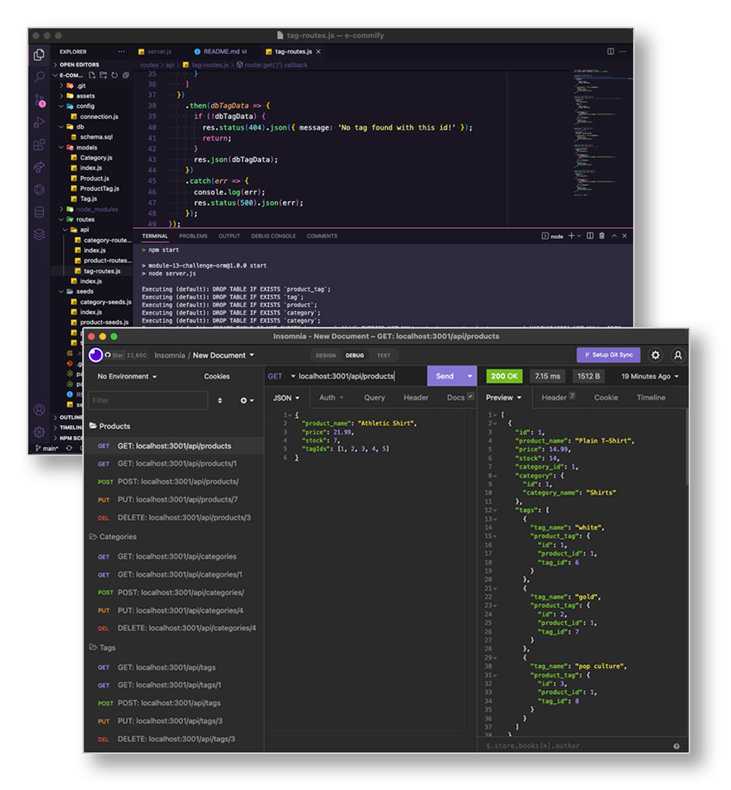

# e-commify
## A small ecommerce product company selling specialized niche items!

## Purpose:
e-commify is an ecommerce product app. The user loads the seeds by typing "npm run seed" in the terminal then the user types "npm start" to load the database and access the server. The user should then use Insomnia to test and access the the ecommerce database product, category and tag routes. The user can GET, POST, PUT and DELETE products, categories and tags. It's extremely easy to use!

## Video Demo:
## https://watch.screencastify.com/v/0IjhTrtRbPj2KDWKgoow

 

## **Table of contents:**
  * [Installation](#installation)
  * [Seeds](#seeds)
  * [Start](#start)
  * [Usage](#usage)
  * [Contribute](#contribute)
  * [Questions](#questions)

 

     

 

 

## This Command Line App Created Using:
* JavaScript
* NodeJS
* MySQL/MySQL2
* Sequelize
* Express
* Insomnia
* dotenv package
* GitHub

 

## Installation:
  ### *To install use this command in the the terminal:*
  ### npm i

 

## Seeds:
  ### *To run seeds use this command in the the terminal:*
  ### npm run seed

 

## Start:
  ### *To start use this command in the the terminal. NOTE: Insomnia should be used to test routes:*
  ### npm start

 

## Usage:
  ### The respository can be cloned and placed in a folder remotely.

 

## Contribute:
### Please contact me regarding contributing to this repository. All additions must be approved.

 

## Questions?
### *If you have any questions here's how to contact me:*
* Username: DronetDevDesign
* Repository: https://github.com/DronetDevDesign
* Email: ron@DronetDevDesign.com
